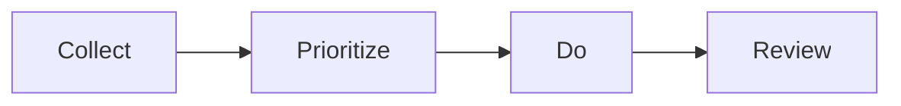

[TOC]

关于读书，Francis Bacon 的 [*Of Study*](http://www.authorama.com/essays-of-francis-bacon-50.html) 以及胡适先生论读书的撰文，读来都让人心旷神怡。

近来读的两本书，[《如何阅读一本书》](https://book.douban.com/subject/1013208/) 针对不同阅读目的给了不少阅读建议，[《如何有效阅读一本书》](https://book.douban.com/subject/26789567/) 则着重讲了让读书、吸收知识这个过程更有效的方法。两书都是译本，虽也有方法论，但实操的建议总觉不过瘾。《如何有效阅读一本书》作者提到的甚至用电脑差不多做电子表格的方法存储笔记，想来日本没有豆瓣读书真是读书人的劫数。

故而我也乐意谈谈个人关于有效阅读的思考及方法。

## 知识范围

阅读除了增长知识，就是拓展思想。而对于需要增长的知识，由是否“意识到”和是否"真实掌握"可分为如下四类：

|            | 真实掌握的         | 没有真实掌握的        |
| ---------- | ------------- | -------------- |
| **意识到的**   | **A**我知道我知道的  | **B**我知道我不知道的  |
| **没有意识到的** | **C**我不知道我知道的 | **D**我不知道我不知道的 |

而单对知识而言，主要是 $D \rightarrow B \rightarrow A$ 这么个转化流程， $D \rightarrow B $ 讲究的是“博”， $ B \rightarrow A$  则讲究的是“精”。**这或“精”或“博”，都能带来新知，而这也是衡量一本书好坏的标杆。**而对于“思想”，又何尝不是这样的呢？

## 量化目标

阅读能带来的收获，如果量化来看的话：


$$
收获 \approx \underset{选书}{每本书新知多少} * \underset{理解消化}{吸收程度} * \underset{速度、习惯}{书的数量}
$$


那么为了最大化阅读的收获，则需要从这几个方面入手：

- 选好书
- 更好的理解消化
- 提高阅读速度、培养阅读习惯

## 有效阅读

对于选书，这跟时间管理、任务管理如GTD一样，需要



详细来说流程就是：

```mermaid
 graph TB
	    subgraph Collect
         A((集书)) --> Collect[各种书单/兴趣延伸]
         Collect --> 豆瓣想读
         end
         subgraph Prioritize
         B((选书)) --> P1[据知识范围定是否读]
         P1 --> P2[据新知多少定哪本先读]
         P2 --> Plan[阅读计划]
         end
         subgraph Do
         C((读书)) --> R[熟悉阅读技巧]
         R --> G[明确阅读目标]
         G --> Digest[详略得当/理解吸收]
         Digest --> H[培养习惯]
         end
         subgraph Review
         D((评书)) --> N[整理笔记]
         N --> Rv[评论写作]
         Rv --> RR[以后重读笔记或整书]
         end
		A --> B;
		B --> C;
		C --> D;
```


### 集书

集书阶段如果其他书单不那么靠谱，或者兴趣延伸不够，还可以考虑从这几个方面阅读以提升自我：

- 胡适的”精博“：让自己发展成T 型人才。

- 培根的历史、诗、自然科学、逻辑、修辞 。
 > Histories make men wise; poets witty; the mathematics subtile; natural philosophy deep; moral grave; logic and rhetoric able to contend.

- 阅读以培养“优良的品性、丰富的知识、应变的才能”。

个人建议，需要针对自己的阅读旨趣，个人需要提升的不同方面的能力，定制化自己需要阅读的书的类型。比如我个人会把书分成如后五大类（实际上是应用8/2原则，每类占比20%）去阅读：

- 文化政治哲学：硬书，可以拓展自己眼界、了解这个世界是如何运作、世界人民都是如何思考的。
- 经济管理文学：这些是更实用一些的书，跟工作生活、投资消遣相关。当然文学书籍本身有更重要的意义（比如通过小说虚拟的人、事去思考，比如读诗养心养性）只是我个人不太偏好，放的比重也就不太大。
- 历史自传：这是大小维度的以史为镜，前车之鉴。我特别着意看的是自传里个人如何在逆境里思考与拼搏，这更有借鉴意义。
- 语言：英语功用自不必说。不同的语言，代表着不同的文化及思想，会有新意。而语言是人这一辈子永远学不完学不厌的，这能让人褒有永久的学习的热情。
- 专业：安身立命，甚至扬名立万之本。

### 选书

在选书阶段：

- **是否需要读**，除了看此书是否能带来新知，还要看豆瓣评分、评论决定此书是否值得花时间，设置花少许时间读读目录、推荐语、样本等再做决定也行。我自己会定期清理评分在8 分以下的一些书，而根据自己**五大类**的标签，如果之前在某一类上收藏的书太多了，也会删得更多。
- **哪本先读**的问题，除了最近急需阅读弥补的知识外，我会尽量保证近期对**五大类**的书都有所涉猎。除此之外，我也会看这本书的豆瓣评论、作者、出版社等。就比如同一本外文书的不同出版社的译本，质量就大相径庭。而就算译者一样的译文书，或者同一个中文作者的书，不同出版社排版、纸张质量也不一，进而就会影响个人的阅读欲望。针对我个人还比较喜欢的不同出版社或其系列书，列出特点大家选书时可作参考。
  - 中华书局：古籍首选。
  - 商务印书馆：学术著作。
  - 三联书店、广西师大理想国：社科必备。
  - 中信出版社：经管颇多，带有自传。
  - 上海译文、译林：译作颇佳。
  - 清华、人民邮电图灵、机工华章：技术书籍。个人觉得机工的书参差不齐。
- **阅读计划** 我会随着个人工作生活的月计划，周计划一起制定。


### 读书

#### 阅读速度

基本的**阅读技巧**，包括提高阅读速度[^SppedReading]：

- 快速换行定位：*Speed Reading for Business* 也提到多数人阅读的1/3 时间是花在换行上的。换行移得慢，或者定位错了重读读过的一行，都是变慢的原因。初步学习是可以用手指指着行首。
- 不要默读或往回重读：平均来说，默读以及到回去读，会消耗掉30% 的阅读时间，所以要避免这个习惯。
- 扩大视野范围：每次定睛聚焦，大概需要花0.3秒到0.5秒，但每次聚焦后，人眼是可以读多个字的。所以得练习跳读并每次读多个字。

[Elevate](https://www.elevateapp.com/)  这个App 里面就有针对提高阅读速度的练习。

#### 详略得当

对于**略读**的图书或图书部分，可用总分总的原则：

1. 总：读目录、推荐语、序、跋
2. 分：读小标题、跳过、或根据阅读主题速读
3. 总：50 字归纳自己的收获

对于**详读**的图书或图书部分，依然可用：

1. 总：理大纲、结构。弄清楚为什么作者会这样组织。
2. 分：阅读主旨、细致理解知识点；也可以针对不同知识点拓展阅读。
3. 总：读完梳理思维导图，作评论。

#### 理解消化

- 阅读前：明确阅读目标、尅期而读（设定阅读deadline）。
- 阅读中：精彩的地方做记号（划线，没笔时折角）、写感想。不懂得寻求答案或向他人情况。
- 阅读后：整理笔记、感想，写评论。有必要时重读笔记或整书，温故而知新。


## 阅读习惯

平日得养成马上、枕上、厕上阅读的习惯，用任何可能空闲的时间阅读。也要让自己随时随地都能方便的接触到书，比如门口、枕边、桌上。要养成外出时也得把书或Kindle 带上，不然就会有失落感的习惯。

[^SppedReading]: http://fourhourworkweek.com/2009/07/30/speed-reading-and-accelerated-learning/