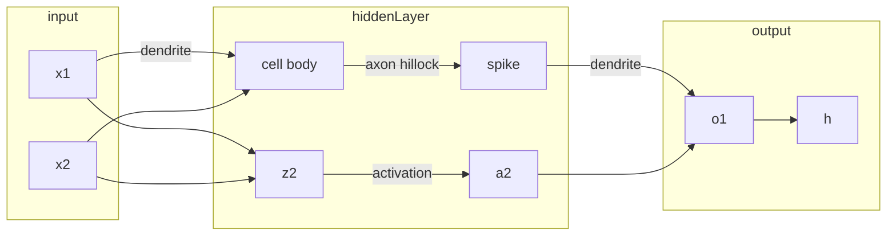
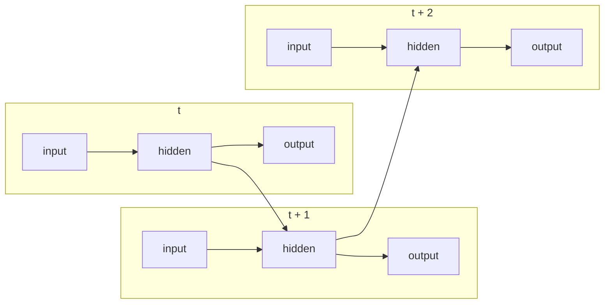

Geoffrey Hinton 在多伦多大学的《[Neural Networks for Machine Learning][NNML] 》课程最近开课，赶紧跟上。

[TOC]

## Week 1

重点介绍NN 如何受到神经元启发而做成。神经元分位四个部分：

1. receptive zone 靠近细胞体的树突（dendrite）可以从不同神经元接收信号。
2. trigger zone 决定是否产生神经冲动spike 并传输给下一个神经元。
3. conducting zone 长长的轴突axon 传输神经电位。
4. output zone 神经末梢输出电位。

对比NN 和神经元的结构：

而activations 函数常用的有：

- **Binary Threshold Neurons** $z\ge threshold$ 时输出1，否则输出0。 
- **Rectified Linear Neurons** (linear threshold neurons)  当 $z\ge 0$ 时输出1，否则输出0。
- **Sigmoid Neurons** 使用sigmoid输出一个 $[0,1]$ 之间的值。

## Week 2

### Main Types of NN architecture

**RNN**: t 时刻某hidden layer的输出也可作为t+1 时刻hidden layer的输入，从而也就有了记忆过去hidden layer weights 的能力。所以RNN 处理时序输入很有优势。

RNN 基础上，神经元之间连接都是双向的，称为**Boltzmann machines**

Boltzmann machines 中没有hidden units 的时候称为 **Hopfield nets**

### First Generation of NN

1. 第一个时期**Perceptron Algorithm**:  根据经验或程序，把原始输入$\vec x$ 转化为对应的特征$\vec f = F(\vec x)$ ,  然后学习求解对于 $ \vec   z = \vec f \cdot \vec w$ 。然后对于$z_i > threshold$ 的样本记为正样本，否则为负样本。学习中权重更新按照：
   - output 正确，不修正权重。
   - output 出错，且输出0，修正权重 $\vec w = \vec w + \vec f$
   - output 出错，且输出1 ，修正权重 $\vec w = \vec w - \vec f$
2. **McCulloch-Pitts** 总结前面总要有阀值，多不方便。直接把阀值当作一个权重岂不就可以了？ $\vec z = \vec x \cdot \vec w + bias = \begin{vmatrix} 1 \\ \vec x \end{vmatrix} \cdot \begin{vmatrix} bias \\ \vec w \end{vmatrix}$  （其实$bias = -threshold$ ），然后用z 值跟0 比较大小判断正负样本即可。

**Mathjax was not loaded successfully**{:.mathjax_alt}

[NNML]: https://www.coursera.org/learn/neural-networks/home/welcome