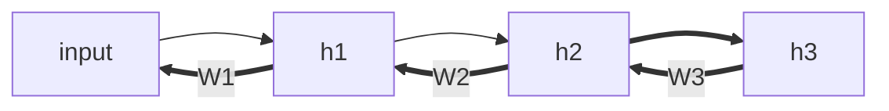

Geoffrey Hinton 在多伦多大学的《[Neural Networks for Machine Learning][NNML] 》课程最近开课，赶紧跟上。

[TOC]

## Week 1

重点介绍NN 如何受到神经元启发而做成。神经元分位四个部分：

1. receptive zone 靠近细胞体的树突（dendrite）可以从不同神经元接收信号。
2. trigger zone 决定是否产生神经冲动spike 并传输给下一个神经元。
3. conducting zone 长长的轴突axon 传输神经电位。
4. output zone 神经末梢输出电位。

对比NN 和神经元的结构：

而activations 函数常用的有：

- **Binary Threshold Neurons** $z\ge threshold$ 时输出1，否则输出0。 
- **Rectified Linear Neurons** (linear threshold neurons)  当 $z\ge 0$ 时输出1，否则输出0。
- **Sigmoid Neurons** 使用sigmoid输出一个 $[0,1]$ 之间的值。

## Week 2

### Main Types of NN architecture

**RNN**: t 时刻某hidden layer的输出也可作为t+1 时刻hidden layer的输入，从而也就有了记忆过去hidden layer weights 的能力。所以RNN 处理时序输入很有优势。

RNN 基础上，神经元之间连接都是双向的，称为**Boltzmann machines**

Boltzmann machines 中没有hidden units 的时候称为 **Hopfield nets**

### First Generation of NN

1. 第一个时期**Perceptron Algorithm**:  根据经验或程序，把原始输入$\vec x$ 转化为对应的特征$\vec f = F(\vec x)$ ,  然后学习求解对于 $ \vec   z = \vec f \cdot \vec w$ 。然后对于$z_i > threshold$ 的样本记为正样本，否则为负样本。学习中权重更新按照：
   - output 正确，不修正权重。
   - output 出错，且输出0，修正权重 $\vec w = \vec w + \vec f$
   - output 出错，且输出1 ，修正权重 $\vec w = \vec w - \vec f$
2. **McCulloch-Pitts** 总结前面总要有阀值，多不方便。直接把阀值当作一个权重岂不就可以了？ $\vec z = \vec x \cdot \vec w + bias = \begin{vmatrix} 1 \\\\ \vec x \end{vmatrix} \cdot \begin{vmatrix} bias \\\\ \vec w \end{vmatrix}$  （其实$bias = -threshold$ ），然后用z 值跟0 比较大小判断正负样本即可。

## Week 3

### Linear neurons

主要是求解$\vec w^T$ 使得在$\vec h = \vec w^T \vec x$ 中 Squared Error Loss $L = \frac 1 2 \sum_i (y_i - h_i)^2$ 最小。其中$y_i$ 代表第i 个样本真实的label。

而每次更新权重就按照负向梯度方向更新权重 $\Delta w_i = - \epsilon * \frac{\partial L}{\partial h_i}  * \frac{\partial h_i}{\partial w_i} = \epsilon * \sum_i (y_i - h_i) * x_i$ 这个来。

### Logistic Neurons

实际上就是求解 $h = \frac{1}{1+e^{-z}}$ （$z = \vec w^T * \vec x$ 而可求解 $\frac{\partial h}{\partial z} = h(1-h)$ ），从而使得上面一样定义的Squared Error Loss 最小，则可求 $\frac{\partial L}{\partial w_i} = - \sum (y_i -h _i) * h_i(1-h_i) * x_i$ 然后更新权重 $\Delta w_i = - \frac{\partial L}{\partial w_i} $ 。

### BP Algorithm

如果不用神经网络，只用LR，那么就需要人工去设计特征。而如果有神经网络后，特别是隐层的神经元可以前向交叉相乘从而达到组合特征的目的。

那么问题来了，有这么多组合后的特征，怎么调整才能效果最好呢？

1. 一种方法就是不停的调整一些神经元权重大小，然后评估这次调整是变好还是变坏。变好就选择新的权重，不者就再尝试新的调整。当然可以并行计算各个神经元的改变值，也可以尽量随机的改变权重，但当神经元个数太大时，这种方法计算消耗还是太大。
2. 用BP 反向找梯度，则能比较好的找到最优的权重改变方向。使用$h_i^l$ 代表每$l$层的输出，下一层的输入$z_j^{l+1} = \sum_i h_i^l * w_{ij}^l$ ，则梯度为 $\frac{\partial L}{\partial h_i^l } = \sum_j \frac{dz_j^{l+1}}{dh_i^l} \frac{\partial L}{\partial z_j^{l+1}} = \sum_j \frac{dz_j^{l+1}}{dh_i^l} \frac{\partial h_j^{l+1}}{\partial z_j^{l+1}} \frac{\partial L}{\partial h_j^{l+1}} = \sum_j w_{ij} * h_j^{l+1}(1-h_j^{l+1})\frac{\partial L}{\partial h_j^{l+1}}$

##  Week 4

Cognitive science 里的两个概念：

> **The feature theory**: A concept is a set of semantic features.
> –  This is good for explaining similarities between concepts.
> **The structuralist theory**: The meaning of a concept lies in its relationshipsto other concepts.
> –   So conceptual knowledge is best expressed as a relational graph.

对于softmax $y_i = \frac{e^{z_i}}{\sum_{j \in group} e^{z_j}}$ 其梯度为 $\frac{\partial y_i}{\partial z_i} = y_i (1-y_i) $ 其中$z_i$ 为softmax group 输入

而cross entropy 为 $C = - \sum_j t_j log\  y_j$  其中$t_j$ 为target value; 而梯度为 $\frac{\partial C}{\partial z_i} = \sum_j \frac{\partial C}{\partial y_i} \frac{\partial y_i}{\partial z_i} = y_i - t_i$ 

对于多分类问题，如果类别太多，整个网络ouput 太多，对于softmax 非常难学。所以用binary tree 做一个hierarchical softmax，然后每次预测一层的单个节点，最后达到叶子节点上正确的值。

## Week 5

object recongnition 难点：

- Segmentation 物体各部分的割裂，哪些部分组合起来才是一个完整的物体？
- Lighting 亮度的强弱影响
- Deformation 物体的变形导致的不规则
- Affordances 预设用途的定义。比如给人坐的就是凳子或椅子，但形态各异。
- Viewpoint 不同视角的影响（这个问题可以用1. 冗余不变的特征；2.框出object 然后如旋转缩放等变换；3. 像CNN 的pooling；4. 不同层次使用像相机一样不同的视角？ ）

Dropout, Pooling, ReLU, 输入变换等都是为了让模型泛化能力更强。

## Week 6

常见的优化方式的利弊
- full gradient batch: 下降方向通常是对的，但是步长选择不好容易在最优点徘徊但不能达到最优点。优化方向如non-linear conjugate gradient，动态调整learning rate 等(迭代次数增多或error 不再降低时，学习率逐次降低)
- stochastic gradient descent 不是全量samples 拿来计算梯度，而是单个样本计算并更新梯度。而如果样本就用线上的，则为 online learning 。
- mini-batches 计算梯度使用部分数据。性能快，复杂神经网络也需要较大的mini-batches。

对于神经网络权重及输入的处理：

- 初始化权重时，需要随机。不然每次训练数据相同的情况下，很容易得到同样的梯度。可以想象每层神经网络都是$\vec W \times \vec z_i$  ，输出跟输入的个数很相关，所以初始化权重也需要正比于$\sqrt{fan- in}$。
- 并且每层输入都做一些预处理（比如减去平均数，再归一化让每层输入方差都比较一致）
- 对于输入，可以做PCA 分析，减少类似的冗余特征。

让mini-batch 学习更快的方式：

1. 使用momentum，保持一定的惯性，保有之前的方向的情况下，加入新的方向修正。修正方式就是 $ \Delta w(t) = v_t = \alpha v_{t-1} - \epsilon \frac{\partial E}{\partial w}(t)$ 其中$\alpha $ 就是之前的方向，新学的梯度就以$\epsilon$ 的方式修正加进来。
2. 对不同的特征使用不同的自适应的学习速率。开始每个weight 的gain 都是1，如果对于某个特征的gradient 的正负号一直不变（亦即没有来回波动）则增加gain $ gain += \delta $，否则大幅减小gain $gain = gain \times (1-\delta) $。并且让gain 再一个还比较合理的范围内比如 $[0.01, 100]$
3. rmsprop:  
   1. 过去两次梯度符号相同时，step size 乘以大于1 的倍数
   2. 符号不相同时，乘以小于1 的倍数
   3. step size 应该<= 50 或大于100 万分之一。
   4. 然后每次gradient 除以 $\sqrt{MeanSquare(w,t)} = \sqrt{0.9 MeanSquare(w,t-1) + 0.1 * gradient_{w,t}^2}$
4. curvature information

其他相关方式可参考[An overview
 of gradient descent optimization algorithms](http://sebastianruder.com/optimizing-gradient-descent/)

## Week 7

Language Model 中，给sequence 建模，简单得讲可以用前n 个词作为输入，输出最近的一个词，从而转化为有监督学习。

Hidden Markove Models，就是不同确切状态（比如One-hot的）间的转换。

RNN 的好处就是，利用了过去信息（状态），且在NN 中非线性的变化中可改变状态。

NN 的初始化非常重要，最好使用学到的参数初始化NN 。

RNN 非常难学，因为：

- 前后向传播差别比较大：前向传播会有squashing(比如logistic )；后向传播则完全是线性的。 
- 长序列中，梯度很容易explode or vanish，所以初始化权重得慎重。
- RNN 层次太深了，非常早之前的信息，也就不一定能保留下来。

所以比较好的几个RNN 实现：

1. LSTM 能把memory 记得更长。
2. Hessian Free Optimization 巧妙地使用optimizer 防止gradients vanishing
3. Echo State Networks 谨慎的依次初始化 Input—> hidden —> output ，而且只学hidden —> output 这一层。
4. Good initilization with momentum，像上面ESN 一样初始化，不过使用momentum 学习。

## Week 8

Week7 中提到 Hessian Free Optimizaiton：如何调整到optimal point 的步伐非常重要。

Newton's method: 使用能量降低最快的方向下降。 $\Delta w = - \epsilon H(w)^{-1} \frac{dE}{dw} $ 其中H 为Curature Matrices(记录每个每个权重对应的下降最快的方向) 的逆。求这个逆，常见的LBFGS 就是其中一个解法。

Echo State Network: 让前向传播考前的层固定，学习后面的层。优点是训练速度快，缺点比RNN 需要更多的隐层。使用ESN 初始化RNN 效果会比较明显。

## Week 9

增加泛化能力，防止过拟合：

1. 使用更多训练样本。

2. 使用合适的模型：能学到真正的规律，但不至于学到不规律的噪音。

   - ​ Architecture: 限制隐层层数和单层节点数。
   - Early Stopping 且初始化较小的权重
   - Weight-decay: 用L1/L2，用Cross -validation 
   - Noise: 权重或activities(X 输入用Gausian 加入噪音；上一层输出为0/1 时按概率增加噪音随机输出相反的1或者0) 增加噪音。

   ​

3. 使用不同类型的模型然后ensemble；抑或同类型的模型在不同训练子集上训练然后bagging

4. Bayesian 法，使用同一个神经网络结构，然后使用不同的权重向量预估，最后对预估求平均。

| Weight penalties                         | Weight constraints                      |
| ---------------------------------------- | --------------------------------------- |
| 对单个特征的Squared Value 进行惩罚                 | 限制weights vector的Squared length，即限制权重数量 |
| 对于最后ERROR 影响较大的weight(对应较大gradient) ，可以较快的进行惩罚，而不是把无关的权重至0 | 防止weights exploding，防止隐层在0 左右徘徊，        |

输入增加高斯噪音，效果等同于L2。假设$y^{noisy} = \sum w_i x_i + \sum w_i \epsilon_i$ 其中$\epsilon_i$ 是 $N(0, \delta_i^2)$ 这个搞死分布中采样而来。则：
$$
\begin{equation} \label{eq0}
\begin{split}
E[(y^{noisy} - t)^2] &= E[((y-t) + \sum w_i\epsilon_i)^2] \\
&= (y-t)^2 + E[(\sum w_i\epsilon_i)^2] + 2(y-t)*\sum w_i E(\epsilon_i) \\
&= (y-t)^2 + E[\sum w_i^2 \epsilon_i^2] \\
&= (y-t)^2 + \sum w_i^2 \delta_i^2
\end{split}
\end{equation}
$$
其中$\epsilon_i$ 与 $\epsilon_j$ 相互独立，且 $\epsilon_i$  与$y-t$ 相互独立，则中间为0 项约掉。

Bayes Theorem: 

$$p(D)p(W|D) = p(W, D) = p(W)p(D|W)$$ 

$$p(W|D) = \frac{p(W)p(D|W)}{p(D)}$$

其中 $p(W,D)$ 为联合概率。$p(W)$ 为权重的先验概率

maximize likelihood 等价于 minimize netative log probs，则有

$p(w) = \frac{1}{\sqrt{2\pi\delta}} e^{-\frac{w^2}{2\delta_w^2}}$ ==> $-\text{log} p(w) =\frac{w^2}{2\delta_w^2} + k $
其中k 未常数，则Bayesian 下的loss 
$$
\begin{equation} \label{eq3}
\begin{split}
-log\ p(W|D) &= -log\ p (D|W) -log\ p(W) + log\ p(D) \\
&= \frac{\sum_c{(y_c-t_c)^2}}{2\delta_D^2} + k1 + \frac{\sum_i{w_i^2}}{2\delta_W^2} + k2 + k_D \\
&= \frac{1}{2\delta_D^2 }* (RSS + \frac{\delta_D^2}{\delta_W^2} \sum w_i^2) + K\\
\end{split}
\end{equation}
$$

实际上跟一般的loss function 也等价，后面项也就L2

## Week 10

两个模型整合：

- 使用不同的模型：如神经网络和GBDT/SVM 等。
- 都用神经网络，但用不同的网络结构(变)

## Week 11

Hopfield Network: 单个神经元只取0/1 值，总能量 
$$
E = - \sum_i s_i b_i - \sum_{i<j} s_i s_j w_{ij}
$$
所以单个神经元能量变化对整体的影响
$$
\Delta E_i = E(s_i = 0) - E(s_i = 1) = b_i + \sum_j s_j w_{ij}
$$
且 
$$
p(v_i, h_j) = \frac{e^{-E(v, h)}}{e^{-E(\vec v, \vec h)}} \propto e^{-E(v_i, h_j)}
$$

## Week 12

$$
\frac{\partial log \   p(\vec v)} {\partial w_{ij}} = \langle s_is_j \rangle _{\vec v} - \langle s_is_j \rangle _{model}
$$

所以CD-1 算法就是如后流程

- Positive phase 让显示层v 在网络中传播，得到隐层h
- Negative phase 让h 传播回显示层得v' ，再传播到隐层得h'
- 更新 $\Delta w = learningRate * (\vec v \vec h^T - \vec v'  \vec h'^T) $

每次更新， $p(s_i = 1) = \sigma (b_i + \sum_j s_j w_{ij})$ 

## Week 13

Belief Nets 主要解决两个问题

- The **inference** problem: Infer thestates of the unobserved variables.
- The **learning** problem: Adjust theinteractions between variables tomake the network more likely togenerate the training data.

对于simoid belief nets， $p_i = p(s_i =1) = sigmoid(\vec \sum_j w_{ji} s_j + b_i)$ 且 $\Delta w_{ji} = \epsilon s_j(s_i - p_i)$

## Week 14

unsupervised pre-trainning: 使用RBM 先依次训练pre-train 靠近visible 层的前几层，这种初始化比random 形式的初始化效果好很多。如后：

RBMs 等价于 infinitely deep sigmoid belief net。

## Week 15

PCA 也有Autoencoder - Autodecoder 的意思。

encode 阶段，主要用一层接一层的 unsupervised pre-trainning 来， RMBs 也就可以拿来encode。decoder 最后使用softmax 输出。

encoder 也可以当作一个hash function，相似的输入能映射到临近的高纬空间中，也就达到了semantic hashing 的目的。

Denoising autoencoders 是在input 中加入噪音，从而让encoder 的泛化能力更强。也可使用惩罚项来做。

**Mathjax was not loaded successfully**{:.mathjax_alt}

[NNML]: https://www.coursera.org/learn/neural-networks/home/welcome